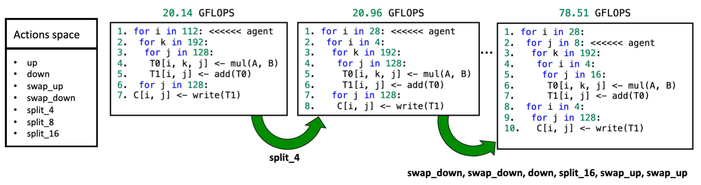

# LoopTune project

The speed of modern deep learning models depends on the efficiency of tensor computations on a given hardware. With the fast development of novel hardware, traditional compilers like LLVM fail to deliver high performance for each architecture, while hand-written libraries are labor-intensive and require high expertise. We present LoopTune, a deep reinforcement learning-based framework for optimizing tensor computations. LoopTune extends ultra-fast lightweight code generator LoopStack, achieving superior results compared to the traditional search algorithm, state-of-the-art autotuners TVM, consistently performing at the level of hand-optimized-library like Numpy.

___
# LoopTool Environment

To map our problem to reinforcement learning lets see example of the problem we are trying to solve. 



In the figure above agent(cursor) starts on line 0 of loop nest and all actions are done on current loop. The agent moves from L0 to L6 with actions "up" and "down". Beside this agent can use "swap_up"/"swap_down" to swap current with the upper/lower loop. Agent can split the current loop into two loops with split power of 2 factor (from 2 to 1024). Agent can merge a loop so it fuses with the parent loops with the same iterator. Agent can annotate current loop with "unroll" and "vectorize" that low level compiler will use to optimize it.

For convenience action space is given here:
* up 
* down
* swap_up
* swap_down
* split_4
* split_8
* split_16

We defined several observation spaces including:
* runtime - execution time in seconds
* gflops - GFLOPs collected from execution
* flops_loop_nest_cached - GFLOPs collected from execution with caching
* ir - string that encodes loop nest
* loop_tree - human readable string of loop tree
* ir_tree_networkx - loop tree encoded in networkx as tree
* ir_graph_networkx - loop tree encoded in networkx as graph
* loops_tensor - torch tensor of features associated to each loop (padded to lt.LoopTreeAgent.max_loops)
* stride_tensor - 1d tensor (len 32) of frequency of memory accesses for stride (power of 2 strides)


___
# How to run

## 0. Setup the environment:
### 0.1 Install CompilerGym
https://github.com/facebookresearch/CompilerGym/blob/development/INSTALL.md

### 0.2 Install LoopTool
https://github.com/facebookresearch/loop_tool.git
Branch: loop_tune

```
export LOOP_TOOL_ROOT=$path_to_this_dir
export WANDB_CONSOLE=off
export MAX_GFLOPS=$peak_gflops_measurement
export RLLIB_NUM_GPUS=$num_gpus_available

```

#### Build from source
```
git clone https://github.com/facebookresearch/loop_tool.git && cd loop_tool
git checkout loop_tune

mkdir build && cd build
cmake .. -DCMAKE_BUILD_TYPE=Release 
```

If cuda fails: 
Add to /home/dx4/tools/loop_tool/CMakeLists.txt:
set(CUDAToolkit_FOUND FALSE)
before first CUDAToolkit_FOUND occurance.

If boost is not found install it with spack install boost
```
make -j$(nproc)
cd ..
python setup.py install
# Check if there is LoopNest is installed as backend:
python -c 'import loop_tool as lt; print(lt.backends())'
```

Uncomment and export GFLOPS from setup.py printed at the end:
```
print(f"export MAX_GFLOPS={os.popen('/private/home/dejang/tools/loop_tool/extern/loop_nest/build/apps/gflops.avx2.fp32').read()}")
```

### Enable Wandb logging
Create Weight and Biases account and put your wandb key in $LOOP_TOOL_ROOT/wandb_key.txt
```
export WANDB_PROJECT_URL=$user_name/$project_name
```

## 1. Generate dateset:
```
python loop_tool_service/benchmarks/generator.py --kind=mm --dimA=64:256:16,64:256:16 --dimB=64:256:16,64:256:16 --out=$LOOP_TOOL_ROOT/loop_tool_service/benchmarks/mm64_256_16_range


# Register dataset
python setup.py install
```

To examine any created benchmark just run:
```
python loop_tool_service/benchmarks/reader.py --bench=path-to-txt-benchmark --actions='csv-actions'
```


## 2. Train policy model:

On SLURM:

```
python loop_tool_service/models/rllib/launcher/slurm_launch.py --app=rllib_agent.py --time=30:00:00 -nc=80 -ng=2 --iter=1000  --dataset=mm64_256_16_range  --trainer=dqn.ApexTrainer --steps=10  --eval_size=25 --eval_time=60

```

On local node:

```
python loop_tool_service/models/rllib/rllib_agent.py --iter=10 --dataset=mm64_256_16_range  --trainer=dqn.ApexTrainer  --eval_size=5 --eval_time=10
```

At the end of the training we print path to the evaluation of the LoopTune policy network.
```
...
Saved at:  $path-to-evaluation-directory
Return from train!
```

To see more login to Wandb and check out training curves and evaluation.

Additionally, you can start training from finished training logged on wandb with adding
```
--wandb_url=$wandb_run_path
```
to the training commands.


## 4. Evaluation:

### Comparison to traditional searches
Once the training is done you can reproduce evaluation with:
```
cd loop_tool_service/experiments/compare_searches
python search.py --trainer=dqn.ApexTrainer --wandb_url=$wandb_run_path
```

If you copy graph to online graphviz you can see visualization of 
searches by adding --debug.


## Comparison to Numpy and TVM

```
cd loop_tool_service/experiments/compare_tvm
python compare_tvm.py --size=25 --wandb_url=$wandb_run_path
```